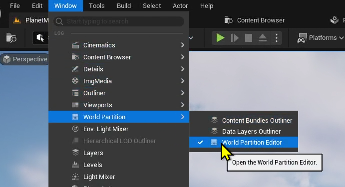

# Apress Source Code

This repository accompanies [*Game Development with Unreal Engine 5 Volume 1*](https://link.springer.com/book/9781484298237) by Tiow Wee Tan (Apress, 2024).

[comment]: #cover

## *IMPORTANT* (LFS)
Since some of the assets of the project can exceed 50Mb, the author had to use the Large File System (LFS) inside Github. 
Therefore, please advise readers *NOT* to use the Green Button to download as a zip file, but to clone the repository to their machine using Git Desktop or a compatible Git client software.

## Releases

Release v1.0 corresponds to the code in the published book, without corrections or updates.

## Contributions

See the file Contributing.md for more information on how you can contribute to this repository.

## Open with UE5.4
The original source was developed with UE5.3, but it is compatible with UE5.4, with the following amendments needed to be made inside the two .Target.cs files under the Source folder as shown in the following screenshot:

## Chapter 2 - 7 (Load World Partition)
From Chapter 2 and onwards, it is necessary to load the Region inside the World Partition when it is first loaded from the source, as shown in the following screenshots:

